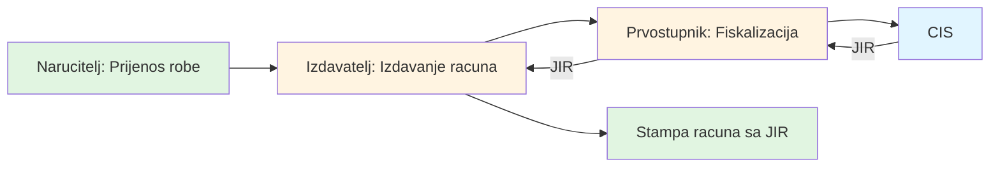

# Chapters 1-2: Introduction and Solution Description

**Source:** Pages 5-39 of Technical Specification v2.6

---

## Chapter 1: Uvod (Introduction)

### Document Purpose

This technical specification describes the Croatian fiscalization system, which requires all cash register operators to:
1. Generate a **ZKI** (Zaštitni Kod Izdavatelja - Security Code) before issuing each invoice
2. Submit invoice data to **CIS** (Centralni Informacijski Sustav - Central Information System)
3. Receive a **JIR** (Jedinstveni Identifikator Računa - Unique Invoice Identifier)
4. Print both ZKI and JIR on every fiscalized invoice

### Target Audience
- Software developers integrating fiscalization into their applications
- Cash register manufacturers
- POS system developers
- Accounting software vendors

### Scope

This specification covers:
- Technical requirements for fiscalization
- XML message formats and schemas
- Digital signature requirements
- Communication protocols with CIS
- Error handling and validation
- Time synchronization requirements

---

## Chapter 2: Opis rješenja (Solution Description)

### System Architecture Overview

The fiscalization system consists of:

1. **Taxpayer System** (Your Application)
   - Point of Sale (POS) or invoicing system
   - Generates ZKI locally
   - Creates XML messages
   - Signs messages with digital certificate
   - Sends requests to CIS
   - Receives and processes JIR

2. **CIS (Centralni Informacijski Sustav)**
   - Operated by Croatian Tax Authority (PU)
   - Receives fiscalization requests
   - Validates data and signatures
   - Returns JIR for invoices
   - Returns confirmations for other operations

3. **FINA System**
   - Handles initial user registration
   - Issues digital certificates
   - Manages certificate lifecycle

### Fiscalization Workflow

#### Step 1: ZKI Generation (Local)

**ZKI** must be generated BEFORE issuing each invoice:

```
ZKI = SHA-256(
    Certificate (without private key) +
    OIB (taxpayer identification number) +
    DatumVrijeme (issue date/time) +
    BrRacuna (invoice number) +
    OznakaSlijeda (sequence indicator) +
    BrojOznakaSlijeda (sequence number) +
    IdPoslovnogProstora (business space ID) +
    OznakaPoslovnogProstora (device ID) +
    IznosUkupno (total amount)
)
```

**Requirements:**
- ZKI must be printed on the invoice
- ZKI generation MUST NOT require network connection
- ZKI must be 32 characters (hexadecimal representation of SHA-256 hash)

#### Step 2: Invoice Issuance

After ZKI is generated:
1. Print the invoice with ZKI
2. Prepare XML message with invoice data
3. Sign the XML message with digital certificate
4. Send to CIS for fiscalization

#### Step 3: JIR Retrieval (Network Required)

After invoice is issued:
1. Send signed XML request to CIS
2. CIS validates the request
3. CIS returns JIR (34-character unique identifier)
4. Print JIR on the invoice (retroactively)

### Time Synchronization Requirements

**CRITICAL:** All systems must have synchronized time!

- **Maximum time difference:** ±2 seconds from CIS time
- **Timezone:** Central European Time (CET/CEST)
- **Format:** ISO 8601 with timezone: `YYYY-MM-DDTHH:MM:SS+01:00`
- **Time sync protocol:** NTP (Network Time Protocol)

**Failure to maintain time sync will result in:**
- Rejected fiscalization requests
- Validation errors
- Inability to generate valid ZKI

### Message Structure

All fiscalization messages follow this structure:

```xml
<FiskalizacijaRequest>
  <Zaglavlje>                    <!-- Header -->
    <IdPoslovnogProstora>...</IdPoslovnogProstora>
    <Oib>...</Oib>
    <DatumVrijeme>...</DatumVrijeme>
  </Zaglavlje>

  <!-- Request body (one of the following) -->
  <PoslovniProstor>...</PoslovniProstor>           <!-- Business space -->
  <Racun>...</Racun>                               <!-- Invoice -->
  <PromjenaNacinaPlacanja>...</PromjenaNacinaPlacanja> <!-- Payment change -->
  <RacunISSN>...</RacunISSN>                       <!-- ISSN -->
  <IzvjesceOIzdanomRacunu>...</IzvjesceOIzdanomRacunu> <!-- Report -->

  <SignatureXml>                <!-- Digital signature -->
    <!-- XML Signature block -->
  </SignatureXml>
</FiskalizacijaRequest>
```

### Header Requirements (Zaglavlje)

Required in every request:

| Element | Type | Description | Required |
|---------|------|-------------|----------|
| `IdPoslovnogProstora` | string | Business space identifier | Yes |
| `Oib` | string (11) | Taxpayer OIB | Yes |
| `DatumVrijeme` | dateTime | Request timestamp (with timezone) | Yes |

**Example:**
```xml
<Zaglavlje>
  <IdPoslovnogProstora>123</IdPoslovnogProstora>
  <Oib>12345678901</Oib>
  <DatumVrijeme>2025-12-08T10:00:00+01:00</DatumVrijeme>
</Zaglavlje>
```

### Invoice Fiscalization Flow



### Payment Method Change Flow


### Response Structure

All CIS responses follow this structure:

```xml
<FiskalizacijaResponse>
  <Zaglavlje>
    <IdPoslovnogProstora>...</IdPoslovnogProstora>
    <Oib>...</Oib>
    <DatumVrijeme>...</DatumVrijeme>
  </Zaglavlje>

  <!-- Response body (varies by service) -->
  <JIR>...</JIR>                    <!-- For invoices -->
  <Status>...</Status>              <!-- For other operations -->

  <SignatureXml>
    <!-- Response signature -->
  </SignatureXml>
</FiskalizacijaResponse>
```

### Error Handling

CIS returns structured error responses:

```xml
<FiskalizacijaResponse>
  <Zaglavlje>...</Zaglavlje>
  <Greske>
    <Greska>
      <SifraGreske>13</SifraGreske>
      <PorukGreske>Description of error</PorukGreske>
    </Greska>
  </Greske>
</FiskalizacijaResponse>
```

**Common Error Codes:**

| Code | Description |
|------|-------------|
| 13 | Validation error (see sub-codes 176-184) |
| 14 | Signature error |
| 176 | Invalid OIB format |
| 177 | Invalid time format |
| 178 | Time difference > 2 seconds |
| 179 | Missing required field |
| 180 | Invalid invoice number |
| 181 | Invalid amount |
| 182 | Invalid tax rate |
| 183 | Invalid business space ID |
| 184 | Invalid certificate |

### Timeout Requirements

- **Connection timeout:** 30 seconds
- **Read timeout:** 60 seconds
- **Maximum retry attempts:** 3
- **Retry delay:** 1 second between attempts

### Security Requirements

1. **Certificate Requirements:**
   - X.509 certificate issued by FINA (Financial Agency)
   - Must contain taxpayer's OIB in Subject field
   - Must be valid (not expired, not revoked)
   - RSA key length: minimum 2048 bits

2. **Signature Requirements:**
   - Use XML Signature standard (W3C xmldsig-core)
   - Signature algorithm: RSAwithSHA1 or RSAwithSHA256
   - Canonicalization method: Exclusive XML Canonicalization
   - Signature must cover entire request body (excluding SignatureXml element)

3. **Transport Security:**
   - HTTPS only (TLS 1.2 or higher)
   - Certificate pinning recommended
   - No fallback to HTTP

### Data Retention

Taxpayers must retain:
- **Invoices:** 11 years (non-fiscalized) or 13 years (fiscalized with JIR)
- **ZKI/JIR records:** 13 years
- **Request/Response XML files:** Recommended 1 year for troubleshooting
- **Audit logs:** Minimum 2 years

---

## Key Takeaways for Implementation

1. **ZKI First:** Always generate ZKI before printing invoice
2. **Time Sync:** Critical! Use NTP servers
3. **Certificate Management:** Handle certificate expiration and renewal
4. **Error Handling:** Implement retry logic and proper error reporting
5. **Offline Mode:** System must work without internet (ZKI generation)
6. **Logging:** Save all request/response XML for troubleshooting
7. **Testing:** Use test environment before production deployment

---

## Implementation Resources

**Documentation:**
- [Chapter 3: Registration and Authentication](03-registration-authentication.md) - Certificate management
- [Chapter 4: Electronic Signature](04-electronic-signature.md) - XML signatures
- [Chapter 5: Services](05-services-overview.md) - Service details

**Technical Standards:**
- W3C XML Signature: https://www.w3.org/TR/xmldsig-core/
- XML Schema: FiskalizacijaSchema v1.3
- SOAP 1.1: https://www.w3.org/TR/2000/NOTE-SOAP-20000508/

**Implementation Libraries:**
- C#: System.Security.Cryptography.Xml
- Java: Apache XML Security, Java XML Digital Signature API
- Python: xmlsec, lxml, PyXMLSec
- PHP: XMLSecLibs, phpseclib

---
