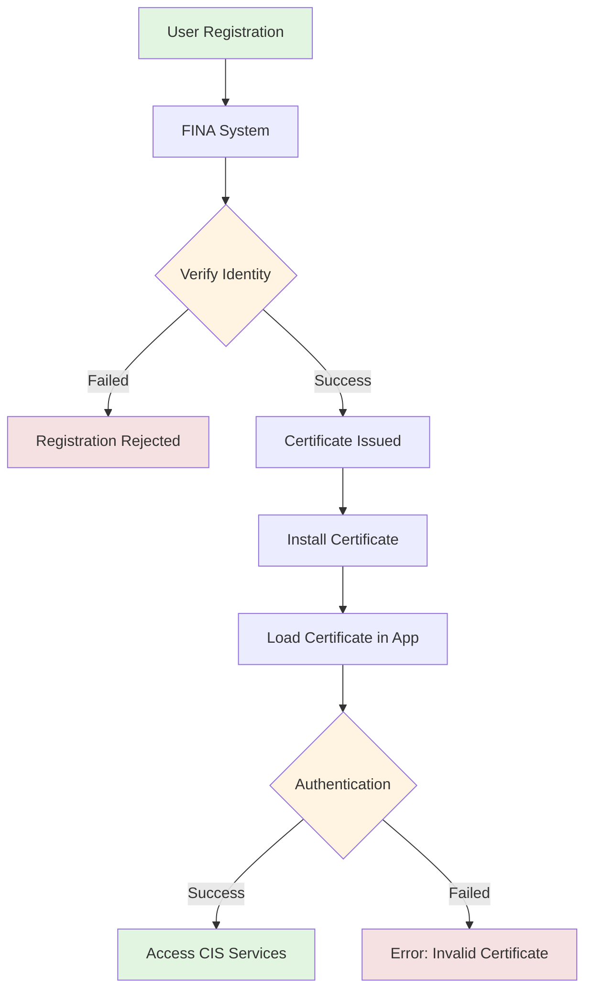
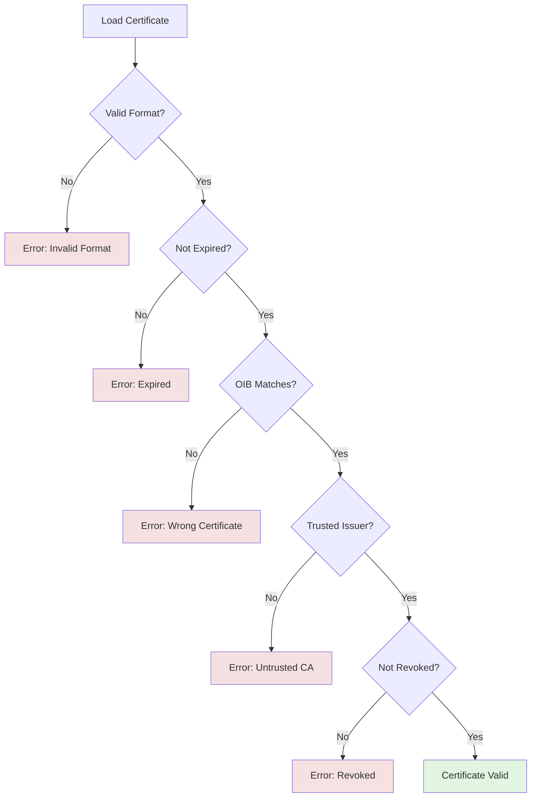

# Chapter 3: Prijava i autentikacija (Registration and Authentication)

**Source:** Pages 40-47 of Technical Specification v2.6

---

## Overview

Before using the fiscalization services, taxpayers must register in the **FINA** system (Financial Agency) and obtain a digital certificate. This chapter covers the registration process and authentication mechanisms.

---

## FINA System

### What is FINA?

**FINA** (Financijska agencija - Financial Agency) is the Croatian financial institution responsible for:
- User registration
- Certificate issuance
- Identity verification
- Authentication for fiscalization services

### FINA System URLs

| Environment | URL |
|-------------|-----|
| Production | `https://cis.porezna-uprava.hr` |
| Test | `https://cistest.apis-it.hr` |

---

## Registration Process

### Step 1: Initial Registration

1. Access FINA system via web interface
2. Enter taxpayer information:
   - **OIB** (Osobni identifikacijski broj - Personal Identification Number): 11 digits
   - Company name
   - Address
   - Contact information
3. Verify identity via FINA
4. Create user account

### Step 2: Certificate Request

After registration:
1. Submit certificate signing request (CSR)
2. Choose certificate type:
   - **Production certificate** - for live fiscalization
   - **Test certificate** - for testing environment
3. Specify certificate validity period (usually 1-3 years)

### Step 3: Certificate Issuance

FINA issues:
- **X.509 digital certificate** (.cer or .crt file)
- **Private key** (.pfx or .p12 file with password)
- Certificate contains taxpayer's OIB in Subject field

### Authentication Flow



---

## Certificate Management

### Certificate Types

| Type | Purpose | Environment |
|------|---------|-------------|
| Production Certificate | Live fiscalization | Production CIS |
| Test Certificate | Testing and development | Test CIS |

**⚠️ WARNING:** Test certificates CANNOT be used in production and vice versa!

### Certificate Format

**X.509 Certificate Structure:**

```
Version: 3
Serial Number: [unique]
Issuer: CN=FINA CA, O=FINA, C=HR
Validity:
  Not Before: [start date]
  Not After:  [end date]
Subject: CN=[OIB], O=[Company Name], C=HR
Subject Public Key Info:
  Algorithm: RSA
  Key Size: 2048 bits (minimum)
Signature Algorithm: SHA256withRSA
```

**Key Point:** The Subject CN field MUST contain the taxpayer's OIB!

### Loading Certificates

#### Option 1: Windows Certificate Store (Recommended)

```csharp
// Load from Windows Certificate Store
var store = new X509Store(StoreName.My, StoreLocation.CurrentUser);
store.Open(OpenFlags.ReadOnly);
var certificates = store.Certificates.Find(
    X509FindType.FindBySubjectName,
    "12345678901", // OIB as subject name
    validOnly: true
);
if (certificates.Count > 0)
{
    var certificate = certificates[0];
}
```

**Advantages:**
- Automatic certificate management
- System-wide access
- Easier renewal

#### Option 2: PFX File (For testing)

```csharp
// Load from PFX file
var certificate = new X509Certificate2(
    "path/to/certificate.pfx",
    "password",
    X509KeyStorageFlags.Exportable
);
```

**Advantages:**
- Portable
- Good for development/testing
- No system dependency

---

## Authentication Process

### 1. Certificate Validation

Before sending requests to CIS:



### 2. OIB Validation

The OIB in the certificate must match:
- The OIB in the request body
- The OIB of the registered taxpayer

**Format:** 11 digits, last digit is control digit

### 3. Certificate Chain Validation

```
[User Certificate]
       ↓ (issued by)
[Intermediate CA - FINA Intermediate CA]
       ↓ (issued by)
[Root CA - FINA Root CA]
```

All certificates in the chain must be:
- Valid (not expired)
- Not revoked (check CRL or OCSP)
- Trusted by the system

---

## Error Handling

### Common Authentication Errors

| Error | Cause | Solution |
|-------|-------|----------|
| Invalid certificate | Corrupted file | Re-import certificate |
| Certificate expired | Expired validity period | Renew certificate |
| OIB mismatch | Wrong certificate for taxpayer | Use correct certificate |
| Untrusted issuer | Root CA not installed | Install FINA root CA |
| Certificate revoked | Revoked by FINA | Contact support |

### Certificate Renewal Process

1. **30 days before expiration:**
   - FINA sends renewal notification
   - User submits renewal request

2. **New certificate issued:**
   - Download new certificate
   - Import to Windows Certificate Store or replace PFX file

3. **Testing:**
   - Test with new certificate in test environment first
   - Verify fiscalization works

4. **Production switch:**
   - Switch to production certificate
   - Monitor for issues

---

## Security Best Practices

### Private Key Protection

⚠️ **CRITICAL:** Private key must NEVER be:
- Shared
- Stored in plain text
- Committed to version control
- Sent via email
- Exposed in logs

**Recommended storage:**
- Windows Certificate Store (with private key protection)
- Encrypted PFX with strong password
- Hardware Security Module (HSM) for high-security environments

### Certificate Backup

1. **Export certificate to PFX:**
   - Include private key
   - Set strong password
   - Store in secure location (encrypted USB, safe)

2. **Document certificate details:**
   - Certificate thumbprint
   - Validity period
   - OIB associated with certificate

3. **Test recovery:**
   - Verify you can restore from backup
   - Document recovery process

---

## Testing Authentication

### Test Environment Setup

1. Obtain test certificate from FINA test environment
2. Install test certificate in test environment only
3. Configure application to use test CIS URL: `https://cistest.apis-it.hr:8449/FiskalizacijaServiceTest`
4. Run authentication test

### Test Script

```csharp
// Test authentication
try
{
    var fis = new Fiskalizacija
    {
        Oib = "12345678901",
        Certifikat = testCertificate,
        CisUrl = "https://cistest.apis-it.hr:8449/FiskalizacijaServiceTest"
    };

    // Test with simple request
    var result = await fis.PoslovniProstorPrijavaAsync(testParams);
    Console.WriteLine("Authentication successful!");
}
catch (CISException ex)
{
    Console.WriteLine($"Authentication failed: {ex.Message}");
}
```

---

## Migration to Production

### Pre-Production Checklist

- [ ] Obtain production certificate
- [ ] Install production certificate securely
- [ ] Update CIS URL to production
- [ ] Test with production certificate in production environment
- [ ] Verify all services work correctly
- [ ] Monitor first few transactions

### Production URLs

```
Production CIS: https://cis.porezna-uprava.hr:8449/FiskalizacijaService
FINA: https://cis.porezna-uprava.hr
```

---

## Implementation Considerations

When implementing certificate handling:

1. **Certificate Loading:** Support both Windows Certificate Store and PFX files
2. **Validation:** Check expiration, revocation, and OIB matching
3. **Error Handling:** Provide clear messages for certificate issues
4. **Security:** Protect private keys, never log or expose them

**Language-specific Examples:**

C#:
```csharp
var store = new X509Store(StoreName.My, StoreLocation.CurrentUser);
store.Open(OpenFlags.ReadOnly);
var certificate = store.Certificates.Find(
    X509FindType.FindBySubjectName,
    "12345678901", // OIB
    validOnly: true
);
```

Java:
```java
KeyStore keystore = KeyStore.getInstance("PKCS12");
keystore.load(new FileInputStream("cert.pfx"), "password".toCharArray());
X509Certificate cert = (X509Certificate) keystore.getCertificate("alias");
```

Python:
```python
from OpenSSL import crypto
cert = crypto.load_certificate(crypto.FILETYPE_PEM, open('cert.pem').read())
```

---

## Related Documentation

- [Chapter 4: Electronic Signature](04-electronic-signature.md) - How to use certificate for signing
- [Chapter 5: Services](05-services-overview.md) - Authenticated service calls

---

*See flow diagram:* [Authentication Flow](docs/diagrams/flow-authentication.mermaid)
