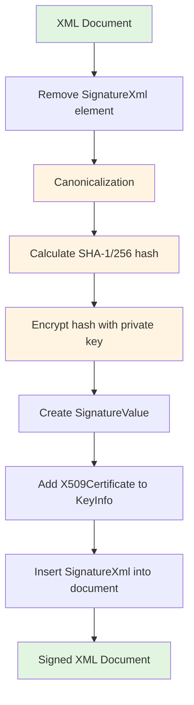
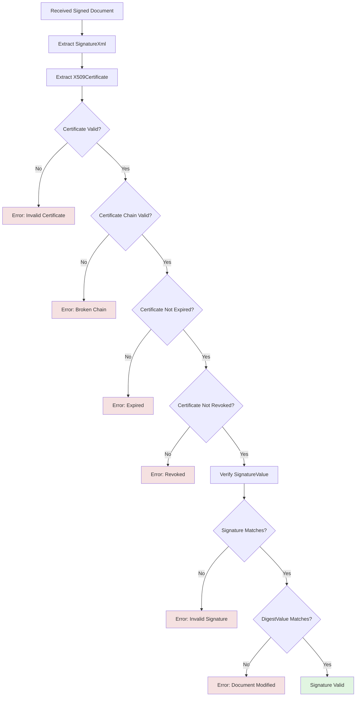
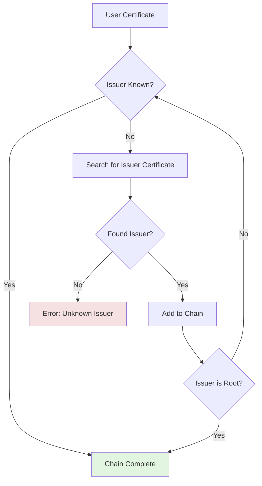
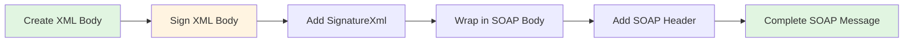

# Chapter 4: Elektronički potpis (Electronic Signature)

**Source:** Pages 48-54 of Technical Specification v2.6

---

## Overview

All fiscalization requests must be digitally signed using XML Signature (W3C xmldsig-core) standard. This chapter covers the technical requirements for creating and validating digital signatures.

---

## XML Signature Standard

### Specification

CIS uses **XML Signature Syntax and Processing (Second Edition)**:
- W3C Recommendation
- Namespace: `http://www.w3.org/2000/09/xmldsig#`
- Schema: xmldsig-core-schema.xsd

### Signature Structure

```xml
<Signature xmlns="http://www.w3.org/2000/09/xmldsig#">
  <SignedInfo>
    <CanonicalizationMethod Algorithm="http://www.w3.org/2001/10/xml-exc-c14n#"/>
    <SignatureMethod Algorithm="http://www.w3.org/2000/09/xmldsig#rsa-sha1"/>
    <Reference URI="">
      <Transforms>
        <Transform Algorithm="http://www.w3.org/2000/09/xmldsig#enveloped-signature"/>
        <Transform Algorithm="http://www.w3.org/2001/10/xml-exc-c14n#"/>
      </Transforms>
      <DigestMethod Algorithm="http://www.w3.org/2000/09/xmldsig#sha1"/>
      <DigestValue>[base64-encoded hash]</DigestValue>
    </Reference>
  </SignedInfo>
  <SignatureValue>[base64-encoded signature]</SignatureValue>
  <KeyInfo>
    <X509Data>
      <X509Certificate>[base64-encoded certificate]</X509Certificate>
    </X509Data>
  </KeyInfo>
</Signature>
```

---

## Signature Creation Process

### Step-by-Step Flow



### Step 1: Document Preparation

1. **Remove SignatureXml element** (if exists)
2. **Canonicalize XML** using Exclusive XML Canonicalization
   - Algorithm: `http://www.w3.org/2001/10/xml-exc-c14n#`
   - Ensures consistent XML representation
   - Removes insignificant whitespace
   - Normalizes attribute order

### Step 2: Hash Calculation

```csharp
// Calculate hash of canonicalized XML
byte[] hash;
using (var sha = SHA256.Create()) // or SHA1
{
    hash = sha.ComputeHash(canonicalXmlBytes);
}
string digestValue = Convert.ToBase64String(hash);
```

**Algorithm Options:**
- SHA-1: `http://www.w3.org/2000/09/xmldsig#sha1` (legacy)
- SHA-256: `http://www.w3.org/2001/04/xmlenc#sha256` (recommended)

### Step 3: Signature Generation

```csharp
// Sign hash with private key
var rsa = (RSACryptoServiceProvider)certificate.PrivateKey;
byte[] signature = rsa.SignHash(hash, CryptoConfig.MapNameToOID("SHA256"));
string signatureValue = Convert.ToBase64String(signature);
```

**Signature Algorithms:**
- RSAwithSHA1: `http://www.w3.org/2000/09/xmldsig#rsa-sha1`
- RSAwithSHA256: `http://www.w3.org/2001/04/xmldsig#rsa-sha256`

### Step 4: Signature Assembly

```xml
<SignatureXml>
  <Signature xmlns="http://www.w3.org/2000/09/xmldsig#">
    <SignedInfo>
      <CanonicalizationMethod
        Algorithm="http://www.w3.org/2001/10/xml-exc-c14n#"/>
      <SignatureMethod
        Algorithm="http://www.w3.org/2000/09/xmldsig#rsa-sha256"/>
      <Reference URI="">
        <Transforms>
          <Transform Algorithm="http://www.w3.org/2000/09/xmldsig#enveloped-signature"/>
          <Transform Algorithm="http://www.w3.org/2001/10/xml-exc-c14n#"/>
        </Transforms>
        <DigestMethod Algorithm="http://www.w3.org/2001/04/xmlenc#sha256"/>
        <DigestValue>B64_DIGEST_VALUE</DigestValue>
      </Reference>
    </SignedInfo>
    <SignatureValue>B64_SIGNATURE_VALUE</SignatureValue>
    <KeyInfo>
      <X509Data>
        <X509Certificate>B64_CERTIFICATE</X509Certificate>
      </X509Data>
    </KeyInfo>
  </Signature>
</SignatureXml>
```

### Step 5: Insert Signature

Add SignatureXml as the **last child** of the root element:

```xml
<FiskalizacijaRequest>
  <Zaglavlje>...</Zaglavlje>
  <Racun>...</Racun>
  <SignatureXml>...</SignatureXml>  <!-- Last element -->
</FiskalizacijaRequest>
```

---

## Signature Validation Process

### CIS Validation Steps



### Validation Checks

1. **Certificate Format**
   - Must be valid X.509 certificate
   - Must include public key

2. **Certificate Chain**
   - User certificate → Intermediate CA → Root CA
   - All certificates in chain must be trusted

3. **Certificate Validity**
   - Not before: Current date ≥ Valid From
   - Not after: Current date ≤ Valid To

4. **Certificate Revocation**
   - Check CRL (Certificate Revocation List)
   - Check OCSP (Online Certificate Status Protocol)

5. **Signature Verification**
   - Verify SignatureValue using public key
   - Verify DigestValue matches document hash

6. **Document Integrity**
   - Signed content must not be modified
   - Only SignatureXml can be added after signing

---

## Certificate Requirements

### X.509 Certificate Specification

```
Version: 3 (0x2)
Serial Number: [unique]
Signature Algorithm: sha256WithRSAEncryption
Issuer: CN=FINA CA, O=FINA d.d., C=HR
Validity
    Not Before: [issue date]
    Not After : [expiration date]
Subject: CN=[OIB], O=[Company Name], C=HR
Subject Public Key Info:
    Public Key Algorithm: rsaEncryption
        RSA Public-Key: (2048 bit)
        Modulus:
            [public key modulus]
        Exponent: 65537 (0x10001)
X509v3 extensions:
    X509v3 Subject Key Identifier:
        [key identifier]
    X509v3 Authority Key Identifier:
        keyid:[authority key id]
    X509v3 Basic Constraints:
        CA:FALSE
    X509v3 Key Usage:
        Digital Signature, Key Encipherment
    X509v3 Extended Key Usage:
        Client Authentication
Signature Algorithm: sha256WithRSAEncryption
    [signature value]
```

### Key Requirements

- **Key size:** Minimum 2048 bits (RSA)
- **Key usage:** Digital Signature, Key Encipherment
- **Extended key usage:** Client Authentication
- **CA:** FALSE (end-entity certificate, not CA)

---

## Certificate Chain Validation

### Chain Structure

```
[User Certificate]
    Issued by: FINA Intermediate CA
    ↓
[Intermediate CA Certificate]
    Issued by: FINA Root CA
    ↓
[Root CA Certificate]
    Self-signed (trusted root)
```

### Validation Process



### Chain Validation Checks

1. **Signature Verification**
   - Each certificate's signature is verified with issuer's public key

2. **Validity Period**
   - All certificates in chain must be valid at time of signing

3. **Revocation Check**
   - Check CRL for each certificate in chain
   - Or use OCSP for real-time verification

4. **Trust Anchor**
   - Root CA must be trusted by system
   - FINA Root CA should be in Trusted Root store

---

## Signature Placement in SOAP

### SOAP Message Structure

```xml
<soap:Envelope xmlns:soap="http://schemas.xmlsoap.org/soap/envelope/">
  <soap:Header>
    <!-- SOAP headers (if any) -->
  </soap:Header>
  <soap:Body>
    <FiskalizacijaRequest xmlns="http://fiskalizacija.porezna.uprava.hr/2013/schema">
      <Zaglavlje>...</Zaglavlje>
      <Racun>...</Racun>
      <SignatureXml>                          <!-- Signature here -->
        <Signature xmlns="http://www.w3.org/2000/09/xmldsig#">
          <!-- Signature content -->
        </Signature>
      </SignatureXml>
    </FiskalizacijaRequest>
  </soap:Body>
</soap:Envelope>
```

**Key Points:**
- SignatureXml is inside FiskalizacijaRequest (before SOAP wrapping)
- Signature covers everything in FiskalizacijaRequest except SignatureXml itself
- SOAP envelope is added AFTER signing

### SOAP Flow



---

## Security Considerations

### Private Key Protection

⚠️ **CRITICAL SECURITY REQUIREMENTS:**

1. **Never expose private key:**
   - Do not log private key
   - Do not include in error messages
   - Do not store in plain text

2. **Secure storage:**
   - Use Windows Certificate Store with private key protection
   - Use strong password for PFX files
   - Consider Hardware Security Module (HSM)

3. **Access control:**
   - Limit access to private key
   - Use key containers when possible
   - Implement audit logging

### Signature Replay Protection

**Timestamp prevents signature replay:**
- DatumVrijeme in header is part of signed content
- CIS verifies timestamp is within ±2 seconds
- Old signatures are rejected

---

## Implementation in Code

### Using .NET XML Signing

The library uses `System.Security.Cryptography.Xml`:

```csharp
using System.Security.Cryptography.Xml;
using System.Security.Cryptography.X509Certificates;

// Create XML document
var doc = new XmlDocument();
doc.LoadXml(requestXml);

// Create signed XML object
var signedXml = new SignedXml(doc);
signedXml.SigningKey = certificate.PrivateKey;

// Create reference to entire document (excluding signature)
var reference = new Reference("");
reference.AddTransform(new XmlDsigEnvelopedSignatureTransform());
reference.AddTransform(new XmlDsigExcC14NTransform());
signedXml.AddReference(reference);

// Set canonicalization and signature methods
signedXml.SignedInfo.CanonicalizationMethod =
    "http://www.w3.org/2001/10/xml-exc-c14n#";
signedXml.SignatureMethod =
    "http://www.w3.org/2000/09/xmldsig#rsa-sha256";

// Add certificate info
var keyInfo = new KeyInfo();
keyInfo.AddClause(new KeyInfoX509Data(certificate));
signedXml.KeyInfo = keyInfo;

// Compute signature
signedXml.ComputeSignature();

// Insert signature
var signatureXml = signedXml.GetXml();
doc.DocumentElement.AppendChild(signatureXml);
```

---

## Implementation Examples

### Using .NET XML Signing

```csharp
using System.Security.Cryptography.Xml;
using System.Security.Cryptography.X509Certificates;

// Create XML document
var doc = new XmlDocument();
doc.LoadXml(requestXml);

// Create signed XML object
var signedXml = new SignedXml(doc);
signedXml.SigningKey = certificate.PrivateKey;

// Add reference to document
var reference = new Reference("");
reference.AddTransform(new XmlDsigEnvelopedSignatureTransform());
reference.AddTransform(new XmlDsigExcC14NTransform());
signedXml.AddReference(reference);

// Compute signature
signedXml.ComputeSignature();

// Insert signature
var signatureXml = signedXml.GetXml();
doc.DocumentElement.AppendChild(signatureXml);
```

### Using Python (xmlsec)

```python
import libxml2
import xmlsec

# Load XML
doc = libxml2.parseFile(requestXml)
signatureNode = xmlsec.Template.create(
    doc,
    xmlsec.Transform.RSA_SHA256,
    xmlsec.Transform.ENVELOPED
)

# Sign
dsigCtx = xmlsec.DSigCtx()
dsigCtx.signKey = xmlsec.Key.fromFileName(privateKeyFile, xmlsec.KeyFormat.PEM)
dsigCtx.sign(signatureNode)

# Save
doc.saveTo(outputFilename, encoding="UTF-8")
```

---

## Related Documentation

- [Chapter 3: Registration and Authentication](03-registration-authentication.md) - Certificate management
- [Chapter 5: Services](05-services-overview.md) - Signed request examples

---

## Flow Diagrams

- [Signature Creation](docs/diagrams/flow-signature-creation.mermaid)
- [Signature Verification](docs/diagrams/flow-signature-verification.mermaid)
- [Certificate Validation](docs/diagrams/flow-certificate-validation.mermaid)
- [Certificate Chain](docs/diagrams/flow-certificate-chain.mermaid)
- [Signature in SOAP](docs/diagrams/flow-signature-soap.mermaid)
