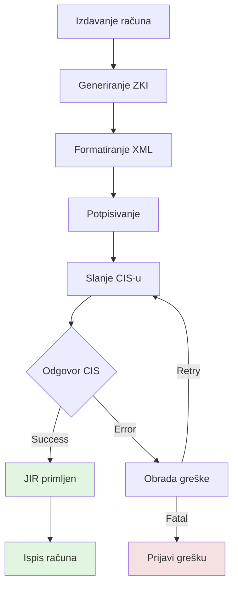

# Services 5.1 - 5.6: Detailed Documentation

**Source:** Pages 55-133 of Technical Specification v2.6

---

## 5.1 Poslovni prostor (Business Space) - Pages 55-65

### Purpose
Register, update, or manage business spaces (locations) where fiscalization occurs.

### Use Cases
- Initial registration of a new business location
- Updating business space information
- Registering multiple devices within a business space

### Request Structure

```xml
<FiskalizacijaRequest>
  <Zaglavlje>...</Zaglavlje>
  <PoslovniProstor>
    <Oib>12345678901</Oib>
    <Naziv>Naziv tvrtke d.o.o.</Naziv>

    <Adresa>
      <Ulica>Ilica 1</Ulica>
      <KucniBroj>10</KucniBroj>
      <KucniBrojDodatak>A</KucniBrojDodatak>
      <BrojPoste>10000</BrojPoste>
      <Naselje>Zagreb</Naselje>
      <Opcina></Opcina>  <!-- Optional -->
    </Adresa>

    <PoslovniProstor>
      <OznakaPoslovnogProstora>1</OznakaPoslovnogProstora>
      <VrstaPoslovnogProstora>Prodajno mjesto</VrstaPoslovnogProstora>
    </PoslovniProstor>

    <!-- Additional devices -->
    <PoslovniProstor>
      <OznakaPoslovnogProstora>2</OznakaPoslovnogProstora>
    </PoslovniProstor>

    <RadnoVrijeme>
      <Dan>Ponedjeljak</Dan>
      <PocetakRadnogVremena>08:00:00</PocetakRadnogVremena>
      <KrajRadnogVremena>16:00:00</KrajRadnogVremena>
    </RadnoVrijeme>

    <DatumPocetkaPrimjene>2025-01-01</DatumPocetkaPrimjene>
  </PoslovniProstor>

  <SignatureXml>...</SignatureXml>
</FiskalizacijaRequest>
```

### Key Elements

| Element | Type | Required | Description |
|---------|------|----------|-------------|
| `Oib` | string(11) | Yes | Taxpayer OIB |
| `Naziv` | string | Yes | Business name |
| `Adresa` | complex | Yes | Address structure |
| `PoslovniProstor` | complex | Yes | One or more devices |
| `OznakaPoslovnogProstora` | string | Yes | Device identifier |
| `RadnoVrijeme` | complex | No | Working hours |
| `DatumPocetkaPrimjene` | date | Yes | Start date |

### Response
```xml
<FiskalizacijaResponse>
  <Zaglavlje>...</Zaglavlje>
  <Status>OK</Status>
  <SignatureXml>...</SignatureXml>
</FiskalizacijaResponse>
```

---

## 5.2 Fiskalizacija računa (Invoice Fiscalization) - Pages 66-71

### Purpose
Submit invoices to CIS and receive JIR (Unique Invoice Identifier).

### Flow Diagram


### Request Structure

```xml
<FiskalizacijaRequest>
  <Zaglavlje>
    <IdPoslovnogProstora>123</IdPoslovnogProstora>
    <Oib>12345678901</Oib>
    <DatumVrijeme>2025-12-08T10:00:00+01:00</DatumVrijeme>
  </Zaglavlje>

  <Racun>
    <Oib>12345678901</Oib>
    <OznakaSlijeda>P</OznakaSlijeda>  <!-- P, N, or specific -->
    <BrojOznakaSlijeda>1</BrojOznakaSlijeda>
    <BrRacuna>1/2025</BrRacuna>
    <DatumVrijeme>2025-12-08T10:00:00+01:00</DatumVrijeme>

    <!-- Payment methods -->
    <NaciniPlacanja>
      <NacinPlacanja>
        <Naziv>G</Naziv>  <!-- G=Gotovina, K=Kartica, etc. -->
        <Iznos>100.00</Iznos>
      </NacinPlacanja>
    </NaciniPlacanja>

    <IznosUkupno>100.00</IznosUkupno>

    <!-- Tax breakdown -->
    <UkupnoPorez>
      <Porez>
        <Naziv>PDV</Naziv>
        <Stopa>25.00</Stopa>
        <Osnovica>80.00</Osnovica>
        <Iznos>20.00</Iznos>
      </Porez>
    </UkupnoPorez>
  </Racun>

  <SignatureXml>...</SignatureXml>
</FiskalizacijaRequest>
```

### Key Elements

| Element | Type | Required | Description |
|---------|------|----------|-------------|
| `Oib` | string(11) | Yes | Taxpayer OIB |
| `OznakaSlijeda` | string | Yes | Sequence indicator (P/N) |
| `BrojOznakaSlijeda` | int | Yes | Sequence number |
| `BrRacuna` | string | Yes | Invoice number |
| `DatumVrijeme` | dateTime | Yes | Invoice date/time |
| `NaciniPlacanja` | array | Yes | Payment methods |
| `IznosUkupno` | decimal | Yes | Total amount |
| `UkupnoPorez` | array | Yes | Tax breakdown |

### Payment Method Codes

| Code | Description |
|------|-------------|
| G | Gotovina (Cash) |
| K | Kartice (Cards) |
| Č | Ček (Check) |
| V | Virman (Bank transfer) |
| P | Pay periodic payments |
| O | Other (Ostalo) |

### Response Structure

```xml
<FiskalizacijaResponse>
  <Zaglavlje>...</Zaglavlje>
  <JIR>1234567890123456789012345678901234</JIR>
  <SignatureXml>...</SignatureXml>
</FiskalizacijaResponse>
```

**JIR Format:** 34 alphanumeric characters

---

## 5.3 Promjena načina plaćanja (Payment Method Change) - Pages 72-81

### Purpose
Update payment information for a previously fiscalized invoice.

### Use Case
Customer pays with different method than originally issued (e.g., switched from cash to card).

### Request Structure

```xml
<FiskalizacijaRequest>
  <Zaglavlje>...</Zaglavlje>

  <PromjenaNacinaPlacanja>
    <Oib>12345678901</Oib>
    <OznakaSlijeda>P</OznakaSlijeda>
    <BrojOznakaSlijeda>1</BrojOznakaSlijeda>
    <BrRacuna>1/2025</BrRacuna>
    <DatumVrijeme>2025-12-08T10:00:00+01:00</DatumVrijeme>
    <IznosUkupno>100.00</IznosUkupno>

    <NaciniPlacanja>
      <NacinPlacanja>
        <Naziv>K</Naziv>
        <Iznos>100.00</Iznos>
      </NacinPlacanja>
    </NaciniPlacanja>
  </PromjenaNacinaPlacanja>

  <SignatureXml>...</SignatureXml>
</FiskalizacijaRequest>
```

### Important Notes

⚠️ **Requirements:**
- Original invoice must be fiscalized (have JIR)
- Total amount must match original invoice
- Cannot change total amount, only payment breakdown
- Must include original invoice identification

### Response
```xml
<FiskalizacijaResponse>
  <Zaglavlje>...</Zaglavlje>
  <Status>OK</Status>
  <SignatureXml>...</SignatureXml>
</FiskalizacijaResponse>
```

---

## 5.4 Fiskalizacija ISSN broj (ISSN Fiscalization) - Pages 82-90

### Purpose
Fiscalize invoices with ISSN (specific invoice type for certain business sectors).

### Request Structure

```xml
<FiskalizacijaRequest>
  <Zaglavlje>...</Zaglavlje>

  <Racun>
    <Oib>12345678901</Oib>
    <OznakaSlijeda>P</OznakaSlijeda>
    <BrojOznakaSlijeda>1</BrojOznakaSlijeda>
    <BrRacuna>1/2025</BrRacuna>
    <DatumVrijeme>2025-12-08T10:00:00+01:00</DatumVrijeme>

    <NaciniPlacanja>
      <NacinPlacanja>
        <Naziv>G</Naziv>
        <Iznos>50.00</Iznos>
      </NacinPlacanja>
    </NaciniPlacanja>

    <IznosUkupno>50.00</IznosUkupno>
    <UkupnoPorez>
      <Porez>
        <Naziv>PDV</Naziv>
        <Stopa>25.00</Stopa>
        <Osnovica>40.00</Osnovica>
        <Iznos>10.00</Iznos>
      </Porez>
    </UkupnoPorez>

    <!-- ISSN-specific element -->
    <ISSN>123456789012345</ISSN>
  </Racun>

  <SignatureXml>...</SignatureXml>
</FiskalizacijaRequest>
```

### ISSN Element

| Element | Type | Required | Description |
|---------|------|----------|-------------|
| `ISSN` | string(15) | Yes | ISSN number |

**ISSN Format:** 15 alphanumeric characters

### Response
Same as regular invoice fiscalization (returns JIR)

---

## 5.5 Izvješće o izdanom računu (Invoice Report) - Pages 91-114

### Purpose
Generate reports about issued invoices for internal audit or tax purposes.

### Report Types

| Type | Name | Description |
|------|------|-------------|
| PD | Promet i devizni tečaj | Currency exchange report |
| PO | Poseban otpis | Special write-off report |

### Request Structure

```xml
<FiskalizacijaRequest>
  <Zaglavlje>...</Zaglavlje>

  <IzvjesceOIzdanomRacunu>
    <Oib>12345678901</Oib>
    <OznakaSlijeda>P</OznakaSlijeda>
    <BrojOznakaSlijeda>1</BrojOznakaSlijeda>
    <BrRacuna>1/2025</BrRacuna>
    <DatumVrijeme>2025-12-08T10:00:00+01:00</DatumVrijeme>
    <IznosUkupno>100.00</IznosUkupno>

    <TipIzvjesca>PO</TipIzvjesca>
    <DatumVrijemeIzdavanja>2025-12-08T10:00:00+01:00</DatumVrijemeIzdavanja>
    <OibPoslovneJedinice>12345678901</OibPoslovneJedinice>
    <NacinPlacanja>G</NacinPlacanja>
  </IzvjesceOIzdanomRacunu>

  <SignatureXml>...</SignatureXml>
</FiskalizacijaRequest>
```

### Key Elements

| Element | Type | Required | Description |
|---------|------|----------|-------------|
| `TipIzvjesca` | string | Yes | Report type (PD/PO) |
| `DatumVrijemeIzdavanja` | dateTime | Yes | Report issuance time |
| `OibPoslovneJedinice` | string(11) | Yes | Business unit OIB |
| `NacinPlacanja` | string | Yes | Payment method |

### Response
```xml
<FiskalizacijaResponse>
  <Zaglavlje>...</Zaglavlje>
  <Status>OK</Status>
  <SignatureXml>...</SignatureXml>
</FiskalizacijaResponse>
```

---

## 5.6 Provjera radnog vremena (Working Hours) - Pages 115-133

### Purpose
Report and verify working hours for business locations.

### Operations

| Operation | Description |
|-----------|-------------|
| PrijaviRadnoVrijeme | Report working hours |
| DohvatiRadnoVrijeme | Retrieve working hours |

### Report Request (PrijaviRadnoVrijeme)

```xml
<FiskalizacijaRequest>
  <Zaglavlje>...</Zaglavlje>

  <PrijaviRadnoVrijemeZaPoslovniceParams>
    <Oib>12345678901</Oib>
    <DatumOd>2025-01-01</DatumOd>
    <DatumDo>2025-12-31</DatumDo>

    <!-- Multiple locations -->
    <RadnoVrijemePoslovnice>
      <OibPoslovnice>12345678901</OibPoslovnice>
      <OznakaPoslovnogProstora>1</OznakaPoslovnogProstora>
      <RadnoVrijeme>
        <Dan>Ponedjeljak</Dan>
        <PocetakRadnogVremena>08:00:00</PocetakRadnogVremena>
        <KrajRadnogVremena>16:00:00</KrajRadnogVremena>
      </RadnoVrijeme>
      <RadnoVrijeme>
        <Dan>Utorak</Dan>
        <PocetakRadnogVremena>08:00:00</PocetakRadnogVremena>
        <KrajRadnogVremena>16:00:00</KrajRadnogVremena>
      </RadnoVrijeme>
    </RadnoVrijemePoslovnice>
  </PrijaviRadnoVrijemeZaPoslovniceParams>

  <SignatureXml>...</SignatureXml>
</FiskalizacijaRequest>
```

### Retrieve Request (DohvatiRadnoVrijeme)

```xml
<FiskalizacijaRequest>
  <Zaglavlje>...</Zaglavlje>

  <DohvatiRadnoVrijemeParams>
    <Oib>12345678901</Oib>
    <OibPoslovnice>12345678901</OibPoslovnice>
    <OznakaPoslovnogProstora>1</OznakaPoslovnogProstora>
    <Datum>2025-12-08</Datum>
  </DohvatiRadnoVrijemeParams>

  <SignatureXml>...</SignatureXml>
</FiskalizacijaRequest>
```

### Working Days (Croatian)

| Value | English |
|-------|---------|
| Ponedjeljak | Monday |
| Utorak | Tuesday |
| Srijeda | Wednesday |
| Četvrtak | Thursday |
| Petak | Friday |
| Subota | Saturday |
| Nedjelja | Sunday |

### Response Structure

```xml
<FiskalizacijaResponse>
  <Zaglavlje>...</Zaglavlje>
  <RadnoVrijemePoslovnice>
    <OibPoslovnice>12345678901</OibPoslovnice>
    <OznakaPoslovnogProstora>1</OznakaPoslovnogProstora>
    <RadnoVrijeme>
      <Dan>Ponedjeljak</Dan>
      <PocetakRadnogVremena>08:00:00</PocetakRadnogVremena>
      <KrajRadnogVremena>16:00:00</KrajRadnogVremena>
    </RadnoVrijeme>
  </RadnoVrijemePoslovnice>
  <SignatureXml>...</SignatureXml>
</FiskalizacijaResponse>
```

---

## Related Code Files

### Implementation

- `Fiskalizacija.cs`:
  - `PoslovniProstorPrijava()` - Business space registration
  - `DohvatiJIR()` - Invoice fiscalization
  - `PromjenaNacinaPlacanja()` - Payment change
  - `DohvatiJIRISSN()` - ISSN fiscalization
  - `IzvjesceOIzdanomRacunu()` - Invoice report
  - `PrijaviRadnoVrijemeZaPoslovnice()` - Report working hours
  - `DohvatiRadnoVrijeme()` - Retrieve working hours

### Parameter Classes

- `PoslovniProstorType` - Business space data
- `RacunType` - Invoice data
- `PromjenaNacinaPlacanjaType` - Payment change data
- `PrijaviRadnoVrijemeZaPoslovniceParams` - Working hours parameters
- `DohvatiRadnoVrijemeParams` - Working hours query

---

## Flow Diagrams

- [Invoice Fiscalization Flow](docs/diagrams/flow-fiskalizacija-racuna.mermaid)
- [Payment Change Flow](docs/diagrams/flow-promjena-placanja.mermaid)

---

## Code Examples

- [Business Space XML](../code-examples/xml-business-space.xml)
- [Invoice Fiscalization XML](../code-examples/xml-invoice-fiscalization.xml)
- [Payment Change XML](../code-examples/xml-payment-change.xml)
- [ISSN Fiscalization XML](../code-examples/xml-issn-fiscalization.xml)
- [Invoice Report XML](../code-examples/xml-invoice-report.xml)
