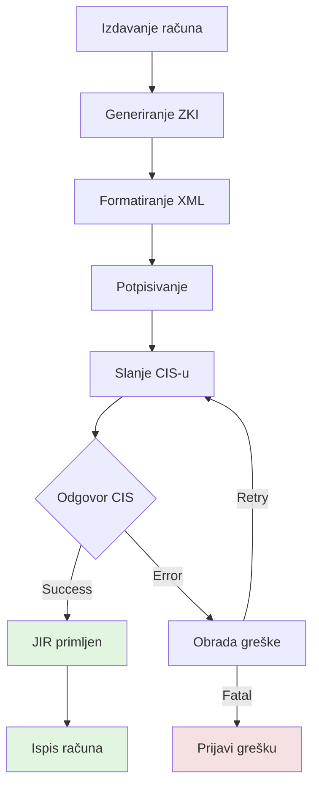

# Services 5.1 - 5.6: Detailed Documentation

**Source:** Pages 55-133 of Technical Specification v2.6

> **Note:** Complete XML examples for all services below are available in [code-examples](../code-examples/) (Chapter 9, examples 9.1-9.57). Each file is transcribed exactly as it appears in the official PDF specification.

---

## 5.1 Poslovni prostor (Business Space) - Pages 55-65

### Purpose
Register, update, or manage business spaces (locations) where fiscalization occurs.

### Use Cases
- Initial registration of a new business location
- Updating business space information
- Registering multiple devices within a business space

### XML Examples

See [code-examples directory](../code-examples/) for complete XML examples. Working hours related examples:
- [Get working hours request](../code-examples/dohvat-radnog-vremena-s-elektronickim-potpisom-942-zahtjev.xml)
- [Get working hours response](../code-examples/dohvat-radnog-vremena-s-elektronickim-potpisom-943-odgovor.xml)
- [Delete working hours request](../code-examples/brisanje-radnog-vremena-s-elektronickim-potpisom-946-zahtjev.xml)
- [Delete working hours response](../code-examples/brisanje-radnog-vremena-s-elektronickim-potpisom-947-odgovor.xml)
- [Report working hours request](../code-examples/prijava-radnog-vremena-s-elektronickim-potpisom-950-zahtjev.xml)
- [Report working hours response](../code-examples/prijava-radnog-vremena-s-elektronickim-potpisom-951-odgovor.xml)
- [Report for list request](../code-examples/prijava-radnih-vremena-liste-poslovnih-s-elektronickim-potpisom-954-zahtjev.xml)
- [Report for list response](../code-examples/prijava-radnih-vremena-liste-poslovnih-s-elektronickim-potpisom-955-odgovor.xml)

### Key Elements

| Element | Type | Required | Description |
|---------|------|----------|-------------|
| `Oib` | string(11) | Yes | Taxpayer OIB |
| `Naziv` | string | Yes | Business name |
| `Adresa` | complex | Yes | Address structure |
| `PoslovniProstor` | complex | Yes | One or more devices |
| `OznakaPoslovnogProstora` | string | Yes | Device identifier |
| `RadnoVrijeme` | complex | No | Working hours |
| `DatumPocetkaPrimjene` | date | Yes | Start date |

---

## 5.2 Fiskalizacija računa (Invoice Fiscalization) - Pages 66-71

### Purpose
Submit invoices to CIS and receive JIR (Unique Invoice Identifier).

### Flow Diagram


### Request Structure

See actual XML examples:
- [Invoice - Original form - Request](../code-examples/racun-izvorni-oblik-91-zahtjev.xml)
- [Invoice - With signature - Request](../code-examples/racun-s-elektronickim-potpisom-92-zahtjev.xml)
- [Invoice - With recipient OIB - Request](../code-examples/racun-s-oib-om-primatelja-935-zahtjev.xml)
- [Change invoice data - Request](../code-examples/racun-938-zahtjev.xml)

**Element structure:**
- `<tns:RacunZahtjev Id="...">` - Root element with unique ID
- `<tns:Zaglavlje>` - Header (IdPoruke, DatumVrijeme)
- `<tns:Racun>` - Invoice body with OIB, timestamps, amounts
- `<Signature>` - Digital signature

### Response Structure

See actual XML examples:
- [Invoice - Original form - Response](../code-examples/racun-izvorni-oblik-93-odgovor.xml)
- [Invoice - With signature - Response](../code-examples/racun-s-elektronickim-potpisom-94-odgovor.xml)
- [Invoice - Error response](../code-examples/racun-greska-s-elektronickim-potpisom-96-odgovor.xml)
- [Invoice with recipient OIB - Response](../code-examples/racun-s-oib-om-primatelja-937-odgovor.xml)
- [Change invoice data - Response](../code-examples/racun-941-odgovor.xml)
        <Iznos>20.00</Iznos>
      </Porez>
    </UkupnoPorez>
  </Racun>

  <SignatureXml>...</SignatureXml>
</FiskalizacijaRequest>
```

### Key Elements

| Element | Type | Required | Description |
|---------|------|----------|-------------|
| `Oib` | string(11) | Yes | Taxpayer OIB |
| `OznakaSlijeda` | string | Yes | Sequence indicator (P/N) |
| `BrojOznakaSlijeda` | int | Yes | Sequence number |
| `BrRacuna` | string | Yes | Invoice number |
| `DatumVrijeme` | dateTime | Yes | Invoice date/time |
| `NaciniPlacanja` | array | Yes | Payment methods |
| `IznosUkupno` | decimal | Yes | Total amount |
| `UkupnoPorez` | array | Yes | Tax breakdown |

### Payment Method Codes

| Code | Description |
|------|-------------|
| G | Gotovina (Cash) |
| K | Kartice (Cards) |
| Č | Ček (Check) |
| V | Virman (Bank transfer) |
| P | Pay periodic payments |
| O | Other (Ostalo) |

### Response Structure

*See actual XML examples in [code-examples](../code-examples/)*

**JIR Format:** 34 alphanumeric characters

---

## 5.3 Promjena načina plaćanja (Payment Method Change) - Pages 72-81

### Purpose
Update payment information for a previously fiscalized invoice.

### Use Case
Customer pays with different method than originally issued (e.g., switched from cash to card).

### XML Examples
- [Payment change - Original form - Request](../code-examples/promjena-nacina-placanja-izvorni-oblik-97-zahtjev.xml)
- [Payment change - With signature - Request](../code-examples/promjena-nacina-placanja-s-elektronickim-potpisom-98-zahtjev.xml)
- [Payment change - Original form - Response](../code-examples/promjena-nacina-placanja-izvorni-oblik-99-odgovor.xml)
- [Payment change - With signature - Response](../code-examples/promjena-nacina-placanja-s-elektronickim-potpisom-910-odgovor.xml)
- [Payment change - Error - Request](../code-examples/promjena-nacina-placanja-s-elektronickim-potpisom-911-zahtjev.xml)
- [Payment change - Error - Response](../code-examples/promjena-nacina-placanja-s-elektronickim-potpisom-914-odgovor.xml)

### Important Notes

⚠️ **Requirements:**
- Original invoice must be fiscalized (have JIR)
- Total amount must match original invoice
- Cannot change total amount, only payment breakdown
- Must include original invoice identification

### Response
*See actual XML examples in [code-examples](../code-examples/)*

---

## 5.4 Fiskalizacija ISSN broj (ISSN Fiscalization) - Pages 82-90

### Purpose
Fiscalize invoices with ISSN (specific invoice type for certain business sectors).

### Request Structure

*See actual XML examples in [code-examples](../code-examples/) - Note: The PDF specification describes ISSN fiscalization, but specific ISSN XML examples are not provided in Chapter 9 examples.*

### ISSN Element

| Element | Type | Required | Description |
|---------|------|----------|-------------|
| `ISSN` | string(15) | Yes | ISSN number |

**ISSN Format:** 15 alphanumeric characters

### Response
Same as regular invoice fiscalization (returns JIR)

---

## 5.5 Izvješće o izdanom računu (Invoice Report) - Pages 91-114

### Purpose
Generate reports about issued invoices for internal audit or tax purposes.

### Report Types

| Type | Name | Description |
|------|------|-------------|
| PD | Promet i devizni tečaj | Currency exchange report |
| PO | Poseban otpis | Special write-off report |

### Request Structure

*See actual XML examples in [code-examples](../code-examples/) - Note: The PDF specification describes invoice reports, but specific report XML examples are not provided in Chapter 9 examples.*

### Key Elements

| Element | Type | Required | Description |
|---------|------|----------|-------------|
| `TipIzvjesca` | string | Yes | Report type (PD/PO) |
| `DatumVrijemeIzdavanja` | dateTime | Yes | Report issuance time |
| `OibPoslovneJedinice` | string(11) | Yes | Business unit OIB |
| `NacinPlacanja` | string | Yes | Payment method |

### Response
*See actual XML examples in [code-examples](../code-examples/)*

---

## 5.6 Provjera radnog vremena (Working Hours) - Pages 115-133

### Purpose
Report and verify working hours for business locations.

### Operations

| Operation | Description |
|-----------|-------------|
| PrijaviRadnoVrijeme | Report working hours |
| DohvatiRadnoVrijeme | Retrieve working hours |

### Report Request (PrijaviRadnoVrijeme)

*See actual XML examples in [code-examples](../code-examples/)*

### Retrieve Request (DohvatiRadnoVrijeme)

*See actual XML examples in [code-examples](../code-examples/)*

### Working Days (Croatian)

| Value | English |
|-------|---------|
| Ponedjeljak | Monday |
| Utorak | Tuesday |
| Srijeda | Wednesday |
| Četvrtak | Thursday |
| Petak | Friday |
| Subota | Saturday |
| Nedjelja | Sunday |

### Response Structure

*See actual XML examples in [code-examples](../code-examples/)*

---

## 5.7 Napojnica (Tip/Gratuity) - Examples 9.21-9.28

### Purpose
Fiscalize tips/gratuities received by employees.

### XML Examples

See [code-examples directory](../code-examples/) for complete XML examples:
- [Tip - With signature - Request](../code-examples/napojnica-s-elektronickim-potpisom-921-zahtjev.xml)
- [Tip - With signature - Request](../code-examples/napojnica-s-elektronickim-potpisom-922-zahtjev.xml)
- [Tip - With signature - Response](../code-examples/napojnica-s-elektronickim-potpisom-923-odgovor.xml)
- [Tip - With signature - Response](../code-examples/napojnica-s-elektronickim-potpisom-924-odgovor.xml)
- [Tip - Request](../code-examples/napojnica-s-elektronickim-potpisom-925-zahtjev.xml)
- [Tip - Request](../code-examples/napojnica-s-elektronickim-potpisom-926-zahtjev.xml)
- [Tip - Error - Response](../code-examples/napojnica-s-elektronickim-potpisom-927-odgovor.xml)
- [Tip - Error - Response](../code-examples/napojnica-s-elektronickim-potpisom-928-odgovor.xml)

### Key Elements

| Element | Type | Required | Description |
|---------|------|----------|-------------|
| `Oib` | string(11) | Yes | Taxpayer OIB |
| `OibPrimatelja` | string(11) | Yes | Recipient OIB (employee) |
| `DatumVrijeme` | dateTime | Yes | Tip date/time |
| `Iznos` | decimal | Yes | Tip amount |

### Response Structure

*See actual XML examples in [code-examples](../code-examples/)*

---

## 5.8 Prodaja samoposlužnih uređaja (Self-Service Device Sales) - Examples 9.15-9.20

### Purpose
Fiscalize sales of self-service devices (e.g., vending machines).

### XML Examples

See [code-examples directory](../code-examples/) for complete XML examples:
- [Self-service - With signature - Request](../code-examples/prodaja-samoposluzni-s-elektronickim-potpisom-915-zahtjev.xml)
- [Self-service - With signature - Request](../code-examples/prodaja-samoposluzni-s-elektronickim-potpisom-916-zahtjev.xml)
- [Self-service - With signature - Response](../code-examples/prodaja-samoposluzni-s-elektronickim-potpisom-917-odgovor.xml)
- [Self-service - With signature - Response](../code-examples/prodaja-samoposluzni-s-elektronickim-potpisom-918-odgovor.xml)
- [Self-service - Error - Response](../code-examples/prodaja-samoposluzni-s-elektronickim-potpisom-919-odgovor.xml)
- [Self-service - Error - Response](../code-examples/prodaja-samoposluzni-s-elektronickim-potpisom-920-odgovor.xml)

### Response Structure

*See actual XML examples in [code-examples](../code-examples/)*

---

## Related Code Files

### Implementation

- `Fiskalizacija.cs`:
  - `PoslovniProstorPrijava()` - Business space registration
  - `DohvatiJIR()` - Invoice fiscalization
  - `PromjenaNacinaPlacanja()` - Payment change
  - `DohvatiJIRISSN()` - ISSN fiscalization
  - `IzvjesceOIzdanomRacunu()` - Invoice report
  - `PrijaviRadnoVrijemeZaPoslovnice()` - Report working hours
  - `DohvatiRadnoVrijeme()` - Retrieve working hours
  - `Napojnica()` - Tip/gratuity fiscalization
  - `ProdajaSamoposluznihUredjaja()` - Self-service device sales

### Parameter Classes

- `PoslovniProstorType` - Business space data
- `RacunType` - Invoice data
- `PromjenaNacinaPlacanjaType` - Payment change data
- `NapojnicaType` - Tip/gratuity data
- `PrijaviRadnoVrijemeZaPoslovniceParams` - Working hours parameters
- `DohvatiRadnoVrijemeParams` - Working hours query

---

## Flow Diagrams

See individual service sections above for flow diagrams and detailed explanations.

---

## Code Examples

All XML examples are from the official specification (Chapter 9, examples 9.1-9.57). Each example is transcribed exactly as it appears in the PDF, including proper SOAP envelope structure.

### Invoice (Racun) Examples (9.1-9.6, 9.31-9.37, 9.38-9.41)
- [Invoice - Original Form - Request](../code-examples/racun-izvorni-oblik-91-zahtjev.xml)
- [Invoice - With Signature - Request](../code-examples/racun-s-elektronickim-potpisom-92-zahtjev.xml)
- [Invoice - Original Form - Response](../code-examples/racun-izvorni-oblik-93-odgovor.xml)
- [Invoice - With Signature - Response](../code-examples/racun-s-elektronickim-potpisom-94-odgovor.xml)
- [Invoice - Error Response - Original Form](../code-examples/racun-izvorni-oblik-95-odgovor.xml)
- [Invoice - Error Response - With Signature](../code-examples/racun-greska-s-elektronickim-potpisom-96-odgovor.xml)
- [Invoice Check - Original Form - Request](../code-examples/racun-izvorni-oblik-931-zahtjev.xml)
- [Invoice Check - With Signature - Request](../code-examples/racun-s-elektronickim-potpisom-932-zahtjev.xml)
- [Invoice Check - Original Form - Response](../code-examples/racun-izvorni-oblik-933-odgovor.xml)
- [Invoice Check - With Signature - Response](../code-examples/racun-s-elektronickim-potpisom-934-odgovor.xml)
- [Invoice with Recipient OIB - Request](../code-examples/racun-s-oib-om-primatelja-935-zahtjev.xml)
- [Invoice with Recipient OIB - Request](../code-examples/racun-s-oib-om-primatelja-936-zahtjev.xml)
- [Invoice with Recipient OIB - Response](../code-examples/racun-s-oib-om-primatelja-937-odgovor.xml)
- [Change Invoice Data - Request](../code-examples/racun-938-zahtjev.xml)
- [Change Invoice Data - Response](../code-examples/racun-939-odgovor.xml)
- [Change Invoice Data - Request](../code-examples/racun-940-zahtjev.xml)
- [Change Invoice Data - Response](../code-examples/racun-941-odgovor.xml)

### Payment Change (Promjena Nacina Placanja) Examples (9.7-9.14)
- [Payment Change - Original Form - Request](../code-examples/promjena-nacina-placanja-izvorni-oblik-97-zahtjev.xml)
- [Payment Change - With Signature - Request](../code-examples/promjena-nacina-placanja-s-elektronickim-potpisom-98-zahtjev.xml)
- [Payment Change - Original Form - Response](../code-examples/promjena-nacina-placanja-izvorni-oblik-99-odgovor.xml)
- [Payment Change - With Signature - Response](../code-examples/promjena-nacina-placanja-s-elektronickim-potpisom-910-odgovor.xml)
- [Payment Change - Error - Request](../code-examples/promjena-nacina-placanja-s-elektronickim-potpisom-911-zahtjev.xml)
- [Payment Change - Error - Request](../code-examples/promjena-nacina-placanja-s-elektronickim-potpisom-912-zahtjev.xml)
- [Payment Change - Error - Response](../code-examples/promjena-nacina-placanja-s-elektronickim-potpisom-913-odgovor.xml)
- [Payment Change - Error - Response](../code-examples/promjena-nacina-placanja-s-elektronickim-potpisom-914-odgovor.xml)

### Self-Service Device Sales (Prodaja samoposlužnih uređaja) Examples (9.15-9.20)
- [Self-service - With Signature - Request](../code-examples/prodaja-samoposluzni-s-elektronickim-potpisom-915-zahtjev.xml)
- [Self-service - With Signature - Request](../code-examples/prodaja-samoposluzni-s-elektronickim-potpisom-916-zahtjev.xml)
- [Self-service - With Signature - Response](../code-examples/prodaja-samoposluzni-s-elektronickim-potpisom-917-odgovor.xml)
- [Self-service - With Signature - Response](../code-examples/prodaja-samoposluzni-s-elektronickim-potpisom-918-odgovor.xml)
- [Self-service - Error - Response](../code-examples/prodaja-samoposluzni-s-elektronickim-potpisom-919-odgovor.xml)
- [Self-service - Error - Response](../code-examples/prodaja-samoposluzni-s-elektronickim-potpisom-920-odgovor.xml)

### Tip (Napojnica) Examples (9.21-9.28)
- [Tip - With Signature - Request](../code-examples/napojnica-s-elektronickim-potpisom-921-zahtjev.xml)
- [Tip - With Signature - Request](../code-examples/napojnica-s-elektronickim-potpisom-922-zahtjev.xml)
- [Tip - With Signature - Response](../code-examples/napojnica-s-elektronickim-potpisom-923-odgovor.xml)
- [Tip - With Signature - Response](../code-examples/napojnica-s-elektronickim-potpisom-924-odgovor.xml)
- [Tip - Request](../code-examples/napojnica-s-elektronickim-potpisom-925-zahtjev.xml)
- [Tip - Request](../code-examples/napojnica-s-elektronickim-potpisom-926-zahtjev.xml)
- [Tip - Error - Response](../code-examples/napojnica-s-elektronickim-potpisom-927-odgovor.xml)
- [Tip - Error - Response](../code-examples/napojnica-s-elektronickim-potpisom-928-odgovor.xml)

### Echo Method Examples (9.29-9.30)
- [Echo Method - Request](../code-examples/echo-metoda-929-zahtjev.xml)
- [Echo Method - Response](../code-examples/echo-metoda-930-odgovor.xml)

### Working Hours (Radno Vrijeme) Examples (9.42-9.57)
- [Get Working Hours - Request](../code-examples/dohvat-radnog-vremena-s-elektronickim-potpisom-942-zahtjev.xml)
- [Get Working Hours - Response](../code-examples/dohvat-radnog-vremena-s-elektronickim-potpisom-943-odgovor.xml)
- [Get Working Hours - Request](../code-examples/dohvat-radnog-vremena-s-elektronickim-potpisom-944-zahtjev.xml)
- [Get Working Hours - Response](../code-examples/dohvat-radnog-vremena-s-elektronickim-potpisom-945-odgovor.xml)
- [Delete Working Hours - Request](../code-examples/brisanje-radnog-vremena-s-elektronickim-potpisom-946-zahtjev.xml)
- [Delete Working Hours - Response](../code-examples/brisanje-radnog-vremena-s-elektronickim-potpisom-947-odgovor.xml)
- [Delete Working Hours - Request](../code-examples/brisanje-radnog-vremena-s-elektronickim-potpisom-948-zahtjev.xml)
- [Delete Working Hours - Response](../code-examples/brisanje-radnog-vremena-s-elektronickim-potpisom-949-odgovor.xml)
- [Report Working Hours - Request](../code-examples/prijava-radnog-vremena-s-elektronickim-potpisom-950-zahtjev.xml)
- [Report Working Hours - Response](../code-examples/prijava-radnog-vremena-s-elektronickim-potpisom-951-odgovor.xml)
- [Report Working Hours - Request](../code-examples/prijava-radnog-vremena-s-elektronickim-potpisom-952-zahtjev.xml)
- [Report Working Hours - Response](../code-examples/prijava-radnog-vremena-s-elektronickim-potpisom-953-odgovor.xml)
- [Report Working Hours for List - Request](../code-examples/prijava-radnih-vremena-liste-poslovnih-s-elektronickim-potpisom-954-zahtjev.xml)
- [Report Working Hours for List - Response](../code-examples/prijava-radnih-vremena-liste-poslovnih-s-elektronickim-potpisom-955-odgovor.xml)
- [Report Working Hours for List - Request](../code-examples/prijava-radnih-vremena-liste-poslovnih-s-elektronickim-potpisom-956-zahtjev.xml)
- [Report Working Hours for List - Response](../code-examples/prijava-radnih-vremena-liste-poslovnih-s-elektronickim-potpisom-957-odgovor.xml)

**For all 57 examples, see the [code-examples directory](../code-examples/).**
